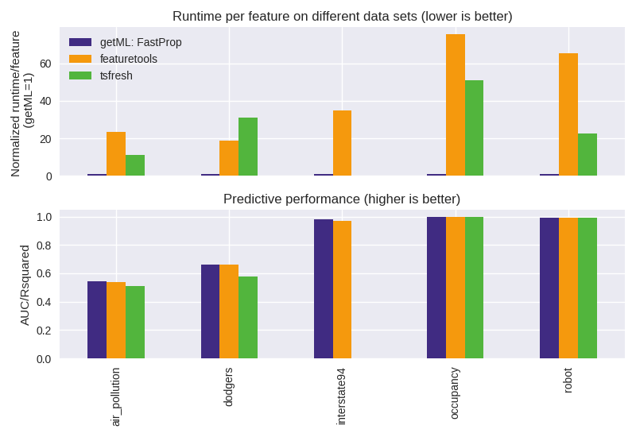

    

    <i>getML combines feature learning with AutoML to build end-to-end prediction pipelines</i>

        <a href="https://binder.mybinder.ovh/v2/gh/getml/getml-demo/master?urlpath=lab" target="_blank" alt="mybinder.org">
        <!-- <a href="https://mybinder.org/v2/gh/getml/getml-demo/master?urlpath=lab" target="_blank" alt="mybinder.org"> -->
        </a>
        
        

 

## Try it live

You can run these notebooks in a jupyterhub environment on our server. No installation or registration required. Start your own getML live demo [here](https://demo.getml.com/v2/gh/getml/getml-demo/master?urlpath=lab). (Launching your docker container might take a minute or two, please be patient.)

You can also download getML for free [here](https://www.getml.com/product/) to run these notebooks locally on your machine.

## Examples

This demo contains various example projects to help you to get started
with relational learning and getML. They cover different aspects of the software, and can serve as documentation or
as blueprints for your own project.

Each project solves a typical data science problem in a specific domain. You
can either choose a project by domain or by the underlying machine learning
problem, e.g. binary classification on a time series or regression using a
relational data scheme involving many tables.

Available example projects are listed below.

|                                                              | Task           | Data                     | Size               | Domain         |
| ------------------------------------------------------------ | -------------- | ------------------------ | ------------------ | -------------- |
| [Financial: Loan default prediction][loansnb]                | Classification | Relational               | 8 tables, 60 MB    | Financial      |
| [Occupancy detection][occupancynb]                           | Classification | Multivariate time series | 1 table, 32k rows  | Energy         |
| [Expenditure categorization][consumerexpendituresnb]         | Classification | Relational               | 3 tables, 150 MB   | E-commerce     |
| [Disease lethality prediction][atherosclerosisnb]            | Classification | Relational               | 3 tables, 22 MB    | Health         |
| [IMDb: Predicting actors' gender][imdbnb]                    | Classification | Relational with text     | 7 tables, 477.1 MB | Entertainment  |
| [MovieLens: Predicting users' gender][movielensnb]           | Classification | Relational               | 7 tables, 20 MB    | Entertainment  |
| [CORA: Categorizing academic studies][coranb]                | Classification | Relational               | 3 tables, 4.6 MB   | Academia       |
| [Order cancellation][onlineretailnb]                         | Classification | Relational               | 1 table, 398k rows | E-commerce     |
| [Traffic volume prediction (I94)][interstate94nb]            | Regression     | Multivariate time series | 1 table, 24k rows  | Transportation |
| [Air pollution prediction][airpollutionnb]                   | Regression     | Multivariate time series | 1 table, 41k rows  | Environment    |
| [Traffic volume prediction (LA)][dodgersnb]                  | Regression     | Multivariate time series | 1 table, 47k rows  | Transportation |
| [Predicting a force vector from sensor data][robotnb]        | Regression     | Multivariate time series | 1 table, 15k rows  | Robotics       |
| [AdventureWorks: Predicting customer churn][adventureworksnb] | Classification | Relational               | 71 tables, 233 MB  | Commerce       |
| [Baseball (Lahman): Predicting salaries][baseballnb]         | Regression     | Relational               | 25 tables, 74 MB   | Sports         |
| [Formula 1 (ErgastF1): Predicting the winner][formula1nb]    | Classification | Relational               | 13 tables, 56 MB   | Sports         |
| [Seznam: Predicting the transaction volume][seznamnb]        | Regression     | Relational               | 4 tables, 147 MB   | E-commerce     |
| [SFScores: Predicting health check scores][sfscoresnb]       | Regression     | Relational               | 3 tables, 9 MB     | Restaurants    |
| [Stats: Predicting users' reputation][statsnb]               | Regression     | Relational               | 8 tables, 658 MB   | Internet       |

## Benchmarks

If you are mainly interested in how getML performs compared to other approaches, you can refer to the following notebooks:

|                                                    | Benchmarks                                       | Results                                     |
| -------------------------------------------------- | ------------------------------------------------ | ------------------------------------------- |
| [Occupancy detection][occupancynb]                 | Academic literature: Neural networks             | AUC (getML 99.8%, next best 99.6%)          |
| [IMDb: Predicting actors' gender][imdbnb]          | Academic literature: RDN, Wordification, RPT     | AUC (getML 91.83%, next best 86%)           |
| [MovieLens: Predicting users' gender][movielensnb] | Academic literature: PRM, MBN                    | Accuracy (getML 81.6%, next best 69%)       |
| [CORA: Categorizing academic studies][coranb]      | Academic literature: RelF, LBP, EPRN, PRN, ACORA | Accuracy (getML 89.9%, next best 85.7%)     |
| [Traffic volume prediction (I94)][interstate94nb]  | Prophet (fbprophet)                              | R-squared (getML 98.4%, prophet 83.3%)      |
| [Traffic volume prediction (LA)][dodgersnb]        | Prophet (fbprophet), tsfresh                     | R-squared (getML 76%, next best 67%)        |
| [Air pollution prediction][airpollutionnb]         | featuretools, tsfresh                            | R-squared (getML 62.3%, next best 53.7%)    |
| [AdventureWorks: Predicting customer churn][adventureworksnb] | featuretools                           | AUC (getML 98.0%, featuretools 96.8%)       |
| [Baseball (Lahman): Predicting salaries][baseballnb]         | featuretools                           | R-squared (getML 84.0%, featuretools 78.0%) |
| [Formula 1 (ErgastF1): Predicting the winner][formula1nb]    | featuretools                           | AUC (getML 92.4%, featuretools 92.0%)       |
| [Seznam: Predicting the transaction volume][seznamnb]        | featuretools                           | R-squared (getML 78.2%, featuretools 63.2%) |
| [SFScores: Predicting health check scores][sfscoresnb]       | featuretools                           | R-squared (getML 27.9%, featuretools 26.1%) |
| [Stats: Predicting users' reputation][statsnb]               | featuretools                           | R-squared (getML 98.1%, featuretools 96.2%) |

### Propositionalization

In particular, we have benchmarked getML's _FastProp_ (short for fast propositionalization) against other implementations of the propositionalization algorithm.

    

As we can see, _FastProp_ is true to its name: It achieves similar or slightly better performance than _featuretools_ or _tsfresh_, but generates features between 11x to 65x faster than these implementations.

If you want to reproduce these results, please refer to the following notebooks:

|                                      | Results                                                 | Remarks                                                                                                                                                                               |
| ------------------------------------ | ------------------------------------------------------- | ------------------------------------------------------------------------------------------------------------------------------------------------------------------------------------- |
| [Air pollution][airpollutionnb_prop] | ~51x faster than featuretools, ~39x faster than tsfresh | The predictive accuracy can be significantly improved by using RelMT instead of propositionalization approaches, please refer to [this notebook][airpollutionnb].                     |
| [Dodgers][dodgersnb_prop]            | ~44x faster than featuretools, ~81x faster than tsfresh | The predictive accuracy can be significantly improved by using the mapping preprocessor and/or more advanced feature learning algorithms, please refer to [this notebook][dodgersnb]. |
| [Interstate94][interstate94nb_prop]  | ~83x faster than featuretools                           |                                                                                                                                                                                       |
| [Occupancy][occupancynb_prop]        | ~61x faster than featuretools, ~34x faster than tsfresh |                                                                                                                                                                                       |
| [Robot][robotnb_prop]                | ~179x faster than featuretools, ~84x faster than tsfresh |                                                                                                                                                                                       |

These results are very hardware-dependent and may be different on your machine. However, we have no doubt that you will find that getML's _FastProp_ is significantly faster than _featuretools_ and _tsfresh_ while consuming considerably less memory.

### Relational Dataset Repository

Some benchmarks are also featured on the [Relational Dataset Repository](https://relational.fit.cvut.cz/):

|                                                                  | Official page                                                           |
| ---------------------------------------------------------------- | ----------------------------------------------------------------------- |
| [AdventureWorks: Predicting customer churn][adventureworksnb]    | [AdventureWorks](https://relational.fit.cvut.cz/dataset/AdventureWorks) |
| [Baseball (Lahman): Predicting salaries][baseballnb]             | [Lahman](https://relational.fit.cvut.cz/dataset/Lahman)                 |
| [CORA: Categorizing academic studies][coranb]                    | [CORA](https://relational.fit.cvut.cz/dataset/CORA)                     |
| [Financial: Loan default prediction][loansnb]                    | [Financial](https://relational.fit.cvut.cz/dataset/Financial)           |
| [Formula 1 (ErgastF1): Predicting the winner][formula1nb]        | [ErgastF1](https://relational.fit.cvut.cz/dataset/ErgastF1)             |
| [IMDb: Predicting actors' gender][imdbnb]                        | [IMDb](https://relational.fit.cvut.cz/dataset/IMDb)                     |
| [MovieLens: Predicting users' gender][movielensnb]               | [MovieLens](https://relational.fit.cvut.cz/dataset/MovieLens)           |
| [Seznam: Predicting the transaction volume][seznamnb]            | [Seznam](https://relational.fit.cvut.cz/dataset/Seznam)                 |
| [SFScores: Predicting health check scores][sfscoresnb]           | [SFScores](https://relational.fit.cvut.cz/dataset/SFScores)             |
| [Stats: Predicting users' reputation][statsnb]                   | [Stats](https://relational.fit.cvut.cz/dataset/Stats)                   |

[loansnb]: https://nbviewer.getml.com/github/getml/getml-demo/blob/master/loans.ipynb
[occupancynb]: https://nbviewer.getml.com/github/getml/getml-demo/blob/master/occupancy.ipynb
[consumerexpendituresnb]: https://nbviewer.getml.com/github/getml/getml-demo/blob/master/consumer_expenditures.ipynb
[atherosclerosisnb]: https://nbviewer.getml.com/github/getml/getml-demo/blob/master/atherosclerosis.ipynb
[imdbnb]: https://nbviewer.getml.com/github/getml/getml-demo/blob/master/imdb.ipynb
[movielensnb]: https://nbviewer.getml.com/github/getml/getml-demo/blob/master/movie_lens.ipynb
[coranb]: https://nbviewer.getml.com/github/getml/getml-demo/blob/master/cora.ipynb
[onlineretailnb]: https://nbviewer.getml.com/github/getml/getml-demo/blob/master/online_retail.ipynb
[interstate94nb]: https://nbviewer.getml.com/github/getml/getml-demo/blob/master/interstate94.ipynb
[airpollutionnb]: https://nbviewer.getml.com/github/getml/getml-demo/blob/master/air_pollution.ipynb
[dodgersnb]: https://nbviewer.getml.com/github/getml/getml-demo/blob/master/dodgers.ipynb
[robotnb]: https://nbviewer.getml.com/github/getml/getml-demo/blob/master/robot.ipynb
[adventureworksnb]: https://nbviewer.getml.com/github/getml/getml-demo/blob/master/adventure_works.ipynb
[baseballnb]: https://nbviewer.getml.com/github/getml/getml-demo/blob/master/baseball.ipynb
[formula1nb]: https://nbviewer.getml.com/github/getml/getml-demo/blob/master/formula1.ipynb
[seznamnb]: https://nbviewer.getml.com/github/getml/getml-demo/blob/master/seznam.ipynb
[sfscoresnb]: https://nbviewer.getml.com/github/getml/getml-demo/blob/master/sfscores.ipynb
[statsnb]: https://nbviewer.getml.com/github/getml/getml-demo/blob/master/stats.ipynb

[airpollutionnb_prop]: https://nbviewer.getml.com/github/getml/getml-demo/blob/master/propositionalization/air_pollution_prop.ipynb
[dodgersnb_prop]: https://nbviewer.getml.com/github/getml/getml-demo/blob/master/propositionalization/dodgers_prop.ipynb
[interstate94nb_prop]: https://nbviewer.getml.com/github/getml/getml-demo/blob/master/propositionalization/interstate94_prop.ipynb
[occupancynb_prop]: https://nbviewer.getml.com/github/getml/getml-demo/blob/master/propositionalization/occupancy_prop.ipynb
[robotnb_prop]: https://nbviewer.getml.com/github/getml/getml-demo/blob/master/propositionalization/robot_prop.ipynb

