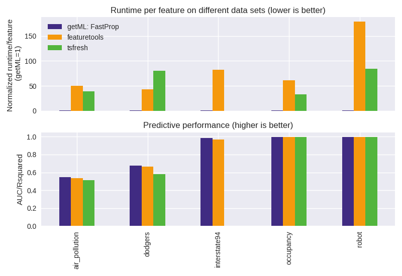

<p align="center" style="text-align: center;">
    
    
</p>

<p align="center" style="text-align: center;">
    <i>getML combines feature learning with AutoML to build end-to-end prediction pipelines</i>
</p>

<p align="center" style="text-align: center;">
        <a href="https://getml.com/latest/contact" target="_blank">
        </a>
        <a href="mailto:hello@getml.com" target="_blank">
        </a>
</p>

<br>
<span style="display: block; border-bottom: 1px solid #eaecef;"></span>
<br>

# Introduction

This repository contains different [Jupyter Notebooks](https://jupyter.org) to demonstrate the capabilities of [getML](https://www.getml.com) in the realm of machine learning on relational data-sets in various domains. getML and its feature engineering algorithms ([FastProp](https://getml.com/latest/user_guide/concepts/feature_engineering/#feature-engineering-algorithms-fastprop), [Multirel](https://getml.com/latest/user_guide/concepts/feature_engineering/#feature-engineering-algorithms-multirel), [Relboost](https://getml.com/latest/user_guide/concepts/feature_engineering/#feature-engineering-algorithms-relboost), [RelMT](https://getml.com/latest/user_guide/concepts/feature_engineering/#feature-engineering-algorithms-relmt)), its [predictors](https://getml.com/latest/user_guide/concepts/predicting#using-getml) (LinearRegression, LogisticRegression, XGBoostClassifier, XGBoostRegressor) and its [hyperparameter optimizer](https://getml.com/latest/user_guide/concepts/hyperopt#hyperparameter-optimization) (RandomSearch, LatinHypercubeSearch, GaussianHyperparameterSearch), are benchmarked against competing tools in similar categories, like [featuretools](https://www.featuretools.com/), [tsfresh](https://tsfresh.com/), and [prophet](https://facebook.github.io/prophet/). While [FastProp](https://getml.com/latest/user_guide/concepts/feature_engineering/#feature-engineering-algorithms-fastprop) usually outperforms the competition in terms of runtime and resource requirements, the more sophisticated algorithms ([Multirel](https://getml.com/latest/user_guide/concepts/feature_engineering/#feature-engineering-algorithms-multirel), [Relboost](https://getml.com/latest/user_guide/concepts/feature_engineering/#feature-engineering-algorithms-relboost), [RelMT](https://getml.com/latest/user_guide/concepts/feature_engineering/#feature-engineering-algorithms-relmt)), which are part of the [Enterprise edition](https://getml.com/latest/enterprise), often lead to even higher accuracy while maintaining low resource requirements. The demonstrations are done on publicly available data-sets, which are standardly used for such comparisons.

# Table of Contents

- [Introduction](#introduction)
- [Table of Contents](#table-of-contents)
- [Usage](#usage)
  - [Reading Online](#reading-online)
  - [Experimenting Locally](#experimenting-locally)
    - [Using Docker](#using-docker)
    - [On the Machine (Linux/x64 \& arm64)](#on-the-machine-linuxx64--arm64)
- [Notebooks](#notebooks)
  - [Overview](#overview)
  - [Descriptions](#descriptions)
  - [Quick access by grouping by](#quick-access-by-grouping-by)
  - [Benchmarks](#benchmarks)
    - [FastProp Benchmarks](#fastprop-benchmarks)
    - [Further Benchmarks in the Relational Dataset Repository](#further-benchmarks-in-the-relational-dataset-repository)

# Usage

The provided notebooks can be checked and used in different ways. 

## Reading Online 

As github renders the notebooks, they can each be viewed by just opening and scrolling through them. For convenience, the output of each cells execution is included.

## Experimenting Locally

To experiment with the notebooks, such as playing with different pipelines and predictors, it is best to run them on a local machine. Linux users with an x64 architecture can choose from one of the options provided below. Soon, we will offer a simple, container-based solution compatible with all major systems (Windows, Mac) and will also support ARM-based architectures.

### Using Docker

There are a `docker-compose.yml` and a `Dockerfile` for easy usage provided.

Simply clone this repository and run the docker command to start the `notebooks` service. The image it depends on will be build if it is not already available.

```
$ git clone https://github.com/getml/getml-demo.git  
$ docker compose up notebooks  
```

To open Jupyter Lab in the browser, look for the following lines in the output and copy-paste them in your browser:

```
Or copy and paste one of these URLs:

http://localhost:8888/lab?token=<generated_token>
```

After the first `getml.engine.launch(...)` is executed and the Engine is started, the corresponding Monitor can be opened in the browser under

```
http://localhost:1709/#/token/token
```

> [!NOTE]  
> Using alternatives to [Docker Desktop](https://www.docker.com/products/docker-desktop) like  
> * [Podman](https://podman.io),  
> * [Podman Desktop](https://podman-desktop.io) or  
> * [Rancher Desktop](https://rancherdesktop.io) with a container engine like dockerd(moby) or containerd(nerdctl)
> 
> allows bind-mounting the notebooks in a user-writeable way (this might need to be included: `userns_mode: keep-id`) instead of having to `COPY` them in. In combination with volume-binding `/home/user/.getML/logs` and `/home/user/.getML/projects`, runs and changes can be persisted across containers.

### On the Machine (Linux/x64 & arm64)

Alternatively, getML and the notebooks can be run natively on the local Linux machine by having certain software installed, like Python and some Python libraries, Jupyter-Lab and the getML Engine. The [getML Python library](https://github.com/getml/getml-community) provides an Engine version without [Enterprise features](https://getml.com/latest/enterprise). In order to replicate Enterprise functionalities in the notebooks, you may obtain an [Enterprise trial version](https://getml.com/latest/enterprise/request-trial).

The following commands will set up a Python environment with necessary Python libraries and the getML Enterprise trial version, and Jupyter-Lab

```
$ git clone https://github.com/getml/getml-demo.git  
$ cd getml-demo  
$ pipx install hatch
$ hatch env create
$ hatch shell
$ pip install -r requirements.txt
$ jupyter-lab
```

> [!TIP]  
> Install the [Enterprise trial version](https://getml.com/latest/enterprise/request-trial) via the  [Install getML on Linux guide](https://getml.com/latest/install/packages/linux#install-getml-on-linux) to try the Enterprise features.

With the last command, Jupyter-Lab should automatically open in the browser. If not, look for the following lines in the output and copy-paste it in your browser:

```
Or copy and paste one of these URLs:

http://localhost:8888/lab?token=<generated_token>
```

After the first `getml.engine.launch(...)` is executed and the Engine is started, the corresponding Monitor can be opened in the browser under

```
http://localhost:1709/#/token/token
```

# Notebooks

This repository contains various demonstrational projects to help getting started with relational learning and getML. They cover different aspects of the software, and can serve as documentation or as blueprints for own projects.

Each project solves a typical data science problem in a specific domain. You
can either choose a project by domain or by the underlying machine learning
problem, e.g. binary classification on a time series or regression using a
relational data scheme involving many tables.

## Overview

|                                                               | Task           | Data                     | Size               | Domain         |
| ------------------------------------------------------------- | -------------- | ------------------------ | ------------------ | -------------- |
| [AdventureWorks: Predicting customer churn][adventureworksnb] | Classification | Relational               | 71 tables, 233 MB  | Commerce       |
| [Air pollution prediction][airpollutionnb]                    | Regression     | Multivariate time series | 1 table, 41k rows  | Environment    |
| [Disease lethality prediction][atherosclerosisnb]             | Classification | Relational               | 3 tables, 22 MB    | Health         |
| [Baseball (Lahman): Predicting salaries][baseballnb]          | Regression     | Relational               | 25 tables, 74 MB   | Sports         |
| [Expenditure categorization][consumerexpendituresnb]          | Classification | Relational               | 3 tables, 150 MB   | E-commerce     |
| [CORA: Categorizing academic studies][coranb]                 | Classification | Relational               | 3 tables, 4.6 MB   | Academia       |
| [Traffic volume prediction (LA)][dodgersnb]                   | Regression     | Multivariate time series | 1 table, 47k rows  | Transportation |
| [Formula 1 (ErgastF1): Predicting the winner][formula1nb]     | Classification | Relational               | 13 tables, 56 MB   | Sports         |
| [IMDb: Predicting actors' gender][imdbnb]                     | Classification | Relational with text     | 7 tables, 477.1 MB | Entertainment  |
| [Traffic volume prediction (I94)][interstate94nb]             | Regression     | Multivariate time series | 1 table, 24k rows  | Transportation |
| [Financial: Loan default prediction][loansnb]                 | Classification | Relational               | 8 tables, 60 MB    | Financial      |
| [MovieLens: Predicting users' gender][movielensnb]            | Classification | Relational               | 7 tables, 20 MB    | Entertainment  |
| [Occupancy detection][occupancynb]                            | Classification | Multivariate time series | 1 table, 32k rows  | Energy         |
| [Order cancellation][onlineretailnb]                          | Classification | Relational               | 1 table, 398k rows | E-commerce     |
| [Predicting a force vector from sensor data][robotnb]         | Regression     | Multivariate time series | 1 table, 15k rows  | Robotics       |
| [Seznam: Predicting the transaction volume][seznamnb]         | Regression     | Relational               | 4 tables, 147 MB   | E-commerce     |
| [SFScores: Predicting health check scores][sfscoresnb]        | Regression     | Relational               | 3 tables, 9 MB     | Restaurants    |
| [Stats: Predicting users' reputation][statsnb]                | Regression     | Relational               | 8 tables, 658 MB   | Internet       |

## Descriptions

<details>
  <summary>Adventure Works - Predicting customer churn</summary>
  
  In the notebook, we demonstrate how getML can be used for a customer churn project using a synthetic dataset of a fictional company. We also benchmark getML against featuretools.
  
  AdventureWorks is a fictional company, that sells bicycles. It is used by Microsoft to showcase how its MS SQL Server can be used to manage business data. Since the dataset resembles a real-world customer database and it is open-source, we use it to showcase, how getML can be used for a classic customer churn project (real customer databases are not easily available for the purposes of showcasing and benchmarking, for reasons of data privacy).
  
  * Prediction type: Classification model
  * Domain: Customer loyalty
  * Prediction target: churn
  * Population size: 19704
  
  [> Open Notebook <](adventure_works.ipynb)
</details>

<details>
  <summary>Air Pollution - Why feature learning is better than simple propositionalization</summary>
  
  In the notebook we compare getML to featuretools and tsfresh, both of which are open-source libraries for feature engineering using propositionalization approaches. We showcase, that advanced algorithms featured in getML yield significantly better predictions on the dataset.
  
  The propositionalization methods usually work as follows:
  
  * Generate a large number of hard-coded features,
  * Use feature selection to pick a percentage of these features.
  
  By contrast, getML contains approaches for feature learning, which adapts machine learning approaches, such as decision trees or gradient boosting, to the problem of extracting features from relational data and time series.
  
  * Prediction type: Regression model
  * Domain: Air pollution
  * Prediction target: pm 2.5 concentration
  * Source data: Multivariate time series
  * Population size: 41757
  
  [> Open Notebook <](air_pollution.ipynb)
  
  [> Open FastProp Benchmark Notebook <](fastprop_benchmark/air_pollution_prop.ipynb)
</details>

<details>
  <summary>Atherosclerosis - Disease lethality prediction</summary>
  
  With the notebook we give a brief introduction to feature engineering on relational data with many columns. We discuss why feature engineering on such data is particularly challenging and what we can do to overcome these problems.
  
  Every column, that we have, can either be aggregated or it can be used for our conditions. That means, if we have n columns to aggregate, we can potentially build conditions for n other columns. In other words, the computational complexity is n\*n in the number of columns.
  
  Note, that this problem occurs regardless of whether you automate feature engineering or you do it by hand. The size of the search space is in the number of columns in either case, unless you can rule something out a-priori.
  
  An algorithm, that generates specific features, can only use columns for conditions, it is not allowed to aggregate columns – and it doesn't need to do so. That means, the computational complexity is linear instead of quadratic. For data sets with a large number of columns this can make all the difference in the world. For instance, if you have 100 columns, the size of the search space of the second approach is only 1% of the size of the search space of the first one.
  
  To illustrate the problem of dimensionality in predictive analytics on relational data, we use a longitudinal study of atherosclerosis patients. One of its defining features is, that it contains many columns, which makes it a good candidate to illustrate the problem discussed in the notebook.
  
  The way, these studies handle the large number of columns in the data set, is to divide the columns into subgroups and then handling each subgroup separately. Even though this is one way to overcome the curse of dimensionality, it is not a very satisfying approach. We would like to be able to handle a large number of columns at once.
  
  * Prediction type: Binary classification
  * Domain: Health
  * Prediction target: Mortality within one year
  * Source data: 146 columns in 2 tables, 22 MB
  * Population size: 28433
  
  [> Open Notebook <](atherosclerosis.ipynb)
</details>

<details>
  <summary>Baseball - Predicting players' salary</summary>
  
  In the notebook, we benchmark several of getML's feature learning algorithms against featuretools using a dataset related to baseball players' salary.
  
  In the late 1990s, the Oakland Athletics began focusing on the idea of sabermetrics, using statistical methods to identify undervalued baseball players. This was done to compensate for the fact, that the team had a significantly smaller budget than most other teams in its league. Under its general manager Billy Beane, the Oakland Athletics became the first team in over 100 years to win 20 consecutive games in a row, despite still being significantly disadvantaged in terms of its budget. After this remarkable success, the use of sabermetrics quickly became the norm in baseball. These events have been documented in a bestselling book and a movie, both called Moneyball.
  
  In the notebook we demonstrate, that relational learning can be used for sabermetrics. Specifically, we develop a model to predict players' salary using getML's statistical relational learning algorithms. Such predictions can be used to identify undervalued players.
  
  * Prediction type: Regression model
  * Domain: Sports
  * Prediction target: Salaries
  * Population size: 23111
  
  [> Open Notebook <](baseball.ipynb)
</details>

<details>
  <summary>Consumer Expenditures - Consumer expenditure categorization</summary>
  
  The notebook demonstrates how powerful a real relational learning algorithm can be. Based on a public-domain dataset on consumer behavior, we use a propostionalization algorithm to predict, whether purchases were made as a gift. We show, that with relational learning, we can get an AUC of over 90%. The generated features would have been impossible to build by hand or by using brute-force approaches.
  
  There are many subdomains of relational learning, but the most important one is extracting features from relational data: Most business data is relational, meaning that it is spread out over several relational tables. However, most machine learning algorithms require, that the data be presented in the form of a single flat table. So we need to extract features from our relational data. Some people also call this data wrangling.
  
  The Consumer Expenditure Data Set is a public domain data set provided by the American Bureau of Labor Statistics. It includes the diary entries, where American consumers are asked to keep diaries of the products they have purchased each month. These consumer goods are categorized using a six-digit classification system: the UCC. This system is hierarchical, meaning that every digit represents an increasingly granular category. The diaries also contain a flag that indicates whether the product was purchased as a gift. The challenge is to predict that flag using other information in the diary entries.
  
  * Prediction type: Classification model
  * Domain: Retail
  * Prediction target: If a purchase is a gift
  * Source data: Relational data set, 4 tables
  * Population size: 2.020.634
  
  [> Open Notebook <](consumer_expenditures.ipynb)
</details>

<details>
  <summary>CORA - Categorizing academic publications</summary>
  
  In the notebook, we compare getML against extant approaches in the relational learning literature on the CORA data set, which is often used for benchmarking. We demonstrate, how getML performs against the state of the art in the relational learning literature on this data set. Beyond the benchmarking aspects, this notebooks showcases getML's excellent capabilities in dealing with categorical data.
  
  CORA is a well-known benchmarking dataset in the academic literature on relational learning. The dataset contains 2708 scientific publications on machine learning. The papers are divided into 7 categories. The challenge is to predict the category of a paper based on the papers it cites, the papers it is cited by and keywords contained in the paper.
  
  * Prediction type: Classification model
  * Domain: Academia
  * Prediction target: The category of a paper
  * Population size: 2708
  
  [> Open Notebook <](cora.ipynb)
</details>

<details>
  <summary>Dodgers - Traffic volume prediction on LA's 101 North freeway</summary>
  
  In the notebook we demonstrate a time series application of getML. We benchmark our results against Facebook's Prophet and tsfresh.
  
  The data set features some particularly interesting characteristics common for time series, which classical models may struggle to deal with. Such characteristics are:
  
  * High frequency (every five minutes)
  * Dependence on irregular events (holidays, Dodgers games)
  * Strong and overlapping cycles (daily, weekly)
  * Anomalies
  * Multiple seasonalities
  
  To quote the maintainers of the data set:
  
  > This loop sensor data was collected for the Glendale on ramp for the 101 North freeway in Los Angeles. It is close enough to the stadium to see unusual traffic after a Dodgers game, but not so close and heavily used by game traffic so that the signal for the extra traffic is overly obvious.
  
  * Prediction type: Regression model
  * Domain: Transportation
  * Prediction target: traffic volume
  * Source data: Univariate time series
  * Population size: 47497
  
  [> Open Notebook <](dodgers.ipynb)
  
  [> Open FastProp Benchmark Notebook <](fastprop_benchmark/dodgers_prop.ipynb)
</details>

<details>
  <summary>Formula 1 - Predicting the winner of a race</summary>
  
  In the notebook we benchmark getML against featuretools to predict the winner of a Formula 1 race.
  
  We develop a prediction model for Formula 1 races, that allows us to predict the winner of a race before the race has started.
  
  We use a dataset of all Formula 1 races from 1950 to 2017. The dataset includes information such as the time taken in each lap, the time taken for pit stops, the performance in the qualifying rounds etc.
  
  * Prediction type: Classification model
  * Domain: Sports
  * Prediction target: Win
  * Population size: 31578
  
  [> Open Notebook <](formula1.ipynb)
</details>

<details>
  <summary>IMDB - Predicting actors' gender</summary>
  
  In the notebook, we demonstrate how getML can be applied to text fields. In relational databases, text fields are less structured and less standardized than categorical data, making it more difficult to extract useful information from them. When using a relational learning tool such as getML, we can easily generate simple features from text fields and leverage the information contained therein.
  
  As an example data set, we use the Internet Movie Database, which has been used by previous studies in the relational learning literature. This allows us to benchmark our approach to state-of-the-art algorithms in the relational learning literature.
  
  The data set contains about 800,000 actors. The goal is to predict the gender of said actors based on other information we have about them, such as the movies they have participated in and the roles they have played in these movies.
  
  * Prediction type: Classification model
  * Domain: Entertainment
  * Prediction target: The gender of an actor
  * Population size: 817718
  
  [> Open Notebook <](imdb.ipynb)
</details>

<details>
  <summary>Interstate 94 - Hourly traffic volume prediction on Interstate 94</summary>
  
  In the notebook, we demonstrate a time series application of getML. We predict the hourly traffic volume on I-94 westbound from Minneapolis-St Paul. We benchmark our results against Facebook's Prophet.
  
  The dataset features some particularly interesting characteristics common for time series, which classical models may struggle to deal with appropriately. Such characteristics are:
  
  * High frequency (hourly)
  * Dependence on irregular events (holidays)
  * Strong and overlapping cycles (daily, weekly)
  * Anomalies
  * Multiple seasonalities
  
  <br>
  
  * Prediction type: Regression model
  * Domain: Transportation
  * Prediction target: Hourly traffic volume
  * Source data: Multivariate time series, 5 components
  * Population size: 24096
  
  [> Open Notebook <](interstate94.ipynb)
  
  [> Open FastProp Benchmark Notebook <](fastprop_benchmark/interstate94_prop.ipynb)
</details>

<details>
  <summary>Loans - Predicting the loan default risk of Czech bank customers</summary>
  
  The notebook demonstrates the application of our relational learning algorithm to predict if a customer of a bank will default on his loan. We train the predictor on customer metadata, transaction history, as well as other successful and unsuccessful loans.
  
  The notebook features a textbook example of predictive analytics applied to the financial sector. A loan is the lending of money to companies or individuals. Banks grant loans in exchange for the promise of repayment. Loan default is defined as the failure to meet this legal obligation, for example, when a home buyer fails to make a mortgage payment. A bank needs to estimate the risk it carries when granting loans to potentially non-performing customers.
  
  * Prediction type: Binary classification
  * Domain: Finance
  * Prediction target: Loan default
  * Source data: 8 tables, 78.8 MB
  * Population size: 682
  
  [> Open Notebook <](loans.ipynb)
</details>

<details>
  <summary>Movie Lens - Predicting a user's gender based on the movies they have watched</summary>
  
  In the notebook we apply getML to a dataset, that is often used for benchmarking in the relational learning literature: The MovieLens dataset.
  
  The MovieLens dataset is often used in the relational learning literature as a benchmark for newly developed algorithms. Following the tradition, we benchmark getML's own algorithms on this dataset as well. The task is to predict a user's gender based on the movies they have watched.
  
  * Prediction type: Classification model
  * Domain: Entertainment
  * Prediction target: The gender of a user
  * Population size: 6039
  
  [> Open Notebook <](movie_lens.ipynb)
</details>

<details>
  <summary>Occupancy - Occupancy detection</summary>
  
  The notebook demonstrates, how to apply getML to multivariate time series and how to use getML's high-level interface for hyperparameter tuning.
  
  Our use case is a public domain data set for predicting room occupancy from sensor data. Note, that this is not only a neat use case for machine learning algorithms, but a real-world application with tangible consequences: If room occupancy is known with sufficient certainty, it can be applied to the control systems of a building. Such as system can reduce the energy consumption by up to 50 %.
  
  Instead of creating features by merging and aggregating peripheral tables in a relational data model, for a (multivariate) time-series, we perform the same operations on the population table itself. This results in features like these:
  
  * Aggregations over time, such as the average value of some column for the last 3 days.
  * Seasonal effects, such as today is a Wednesday, so let's get the average value for the last four Wednesdays.
  * Lag variables, such as get the value of some column from two hours ago.
  
  Using getML's algorithms for relational learning, we extract all of these features automatically. Having created a flat table of such features, we then apply state-of-the-art machine learning algorithms, like xgboost.
  
  The present analysis is based on a public domain time series dataset. It is available in the UC Irvine Machine Learning Repository. The challenge is straightforward: We want to predict whether an office room is occupied at a given moment in time using sensor data. The data is measured about once a minute. Ground-truth occupancy was obtained from time-stamped pictures. The available columns are
  
  * Date, year-month-day hour:minute:second
  * Temperature, in Celsius
  * Relative Humidity, %
  * Light, in Lux
  * CO2, in ppm
  * Humidity Ratio, Derived quantity from temperature and relative humidity, in kgwater-vapor/kg-air
  * Occupancy, 0 or 1, 0 for not occupied, 1 for occupied status
  
  <br>
  
  * Prediction type: Binary classification
  * Domain: Energy
  * Prediction target: Room occupancy
  * Source data: 1 table, 32k rows
  * Population size: 32k
  
  [> Open Notebook <](occupancy.ipynb)
  
  [> Open FastProp Benchmark Notebook <](fastprop_benchmark/occupancy_prop.ipynb)
</details>

<details>
  <summary>Online Retail - Predicting order cancellations</summary>
  
  The notebook demonstrate, how getML can be applied in an e-commerce context. We also show, that we can significantly improve our results by using getML's built-in hyperparameter tuning routines.
  
  The data set contains about 400,000 orders from a British online retailer. Each order consists of a product that has been ordered and a corresponding quantity. Several orders can be summarized onto a single invoice. The goal is to predict whether an order will be cancelled.
  
  Because the company mainly sells to other businesses, the cancellation rate is relatively low, namely 1.83%.
  
  * Prediction type: Classification model
  * Domain: E-commerce
  * Prediction target: Whether an order will be cancelled
  * Population size: 397925
  
  [> Open Notebook <](online_retail.ipynb)
</details>

<details>
  <summary>Robot - Feature engineering on sensor data - how to overcome feature explosion</summary>
  
  The purpose of this notebook is to illustrate, how we can overcome the feature explosion problem based on an example dataset involving sensor data.
  
  Every column that we have, can either be aggregated or it can be used for our conditions. That means, if we have n columns to aggregate, we can potentially build conditions for n other columns. In other words, the computational complexity is n\*n in the number of columns. Note, that this problem occurs regardless of whether you automate feature engineering or you do it by hand. The size of the search space is n\*n in the number of columns in either case, unless you can rule something out a-priori. This problem is known as feature explosion.
  
  An algorithm, that generates specific different features can only use columns for conditions, it is not allowed to aggregate columns – and it doesn't need to do so. That means, the computational complexity is linear instead of quadratic. For data sets with a large number of columns, this can make all the difference in the world. For instance, if you have 100 columns the size of the search space of the second approach is only 1% of the size of the search space of the first one.
  
  getML features an algorithm called Relboost, which generates features according to this principle and is therefore very suitable for data sets with many columns.
  
  To illustrate the problem, we use a data set related to robotics. When robots interact with humans, the most important thing is, that they don't hurt people. In order to prevent such accidents, the force vector on the robot's arm is measured. However, measuring the force vector is expensive. Therefore, we want consider an alternative approach, where we would like to predict the force vector based on other sensor data that are less costly to measure. To do so, we use machine learning. However, the data set contains measurements from almost 100 different sensors and we do not know which and how many sensors are relevant for predicting the force vector.
  
  * Prediction type: Regression
  * Domain: Robotics
  * Prediction target: The force vector on the robot's arm
  * Population size: 15001
  
  [> Open Notebook <](robot.ipynb)
  
  [> Open FastProp Benchmark Notebook <](fastprop_benchmark/robot_prop.ipynb)
</details>

<details>
  <summary>Seznam - Predicting the transaction volume </summary>
  
  Seznam is a Czech company with a scope similar to Google. The purpose of the notebook is to analyze data from Seznam's wallet, predicting the transaction volume.
  
  * Prediction type: Regression model
  * Domain: E-commerce
  * Prediction target: Transaction volume
  * Population size: 1,462,078
  
  [> Open Notebook <](seznam.ipynb)
</details>

<details>
  <summary>SFScores - Predicting the Results of Health Inspections of Restaurants</summary>
  
  In the notebook, we benchmark several of getML's feature learning algorithms against featuretools using the San Francisco Dept. of Public Health's database of eateries in San Francisco. These eateries are regularly inspected. The inspections often result in a score. The challenge is to predict the score resulting from an inspection.
  
  * Prediction type: Regression model
  * Domain: Health
  * Prediction target: Sales
  * Population size: 12887
  
  [> Open Notebook <](sfscores.ipynb)
</details>

<details>
  <summary>Stats - Predicting Users' Reputations</summary>
  
  In the notebook we use relational learning techniques to predict users' reputation on StackExchange. StatsExchange is a website similar to StackOverflow, but based on statistics and machine learning. Much like StackOverflow, it has a complicated system of calculating users' reputation.
  
  * Prediction type: Regression model
  * Domain: Internet
  * Prediction target: Reputation
  * Population size: 41793
  
  [> Open Notebook <](stats.ipynb)
</details>

## Quick access by grouping by

<details>
  <summary>Task</summary>

  - <details>
    <summary>Classification</summary>

    * [Adventure Works][adventureworksnb]                      
    * [Atherosclerosis][atherosclerosisnb]                     
    * [Consumer Expenditures][consumerexpendituresnb]          
    * [CORA][coranb]                                           
    * [Formula 1][formula1nb]                                  
    * [IMDB][imdbnb]                                           
    * [Loans][loansnb]                                         
    * [MovieLens][movielensnb]                                 
    * [Occupancy][occupancynb]                                 
    * [Online Retail][onlineretailnb]                          

    </details>
  - <details>
    <summary>Regression</summary>

    * [Air Pollution][airpollutionnb]                          
    * [Baseball][baseballnb]                                   
    * [Dodgers][dodgersnb]                                     
    * [Interstate 94][interstate94nb]                          
    * [Robot][robotnb]                                         
    * [Seznam][seznamnb]                                       
    * [SFScores][sfscoresnb]                                   
    * [Stats][statsnb]                                         
    </details>
</details>

<details>
  <summary>Data</summary>

  - <details>
    <summary>Relational</summary>
  
    * [Adventure Works][adventureworksnb]                      
    * [Atherosclerosis][atherosclerosisnb]                     
    * [Baseball][baseballnb]                                   
    * [Consumer Expenditures][consumerexpendituresnb]          
    * [CORA][coranb]                                           
    * [Formula 1][formula1nb]                                  
    * [Loans][loansnb]                                         
    * [MovieLens][movielensnb]                                 
    * [Online Retail][onlineretailnb]                          
    * [Seznam][seznamnb]                                       
    * [SFScores][sfscoresnb]                                   
    * [Stats][statsnb]                                         
    </details>
  - <details>
    <summary>Relational With Text</summary>
  
    * [IMDB][imdbnb]                                           
    </details>
  - <details>
    <summary>Multivariate Time Series</summary>
  
    * [Air Pollution][airpollutionnb]                          
    * [Dodgers][dodgersnb]                                     
    * [Interstate 94][interstate94nb]                          
    * [Occupancy][occupancynb]                                 
    * [Robot][robotnb]                                         
    </details>
</details>

<details>
  <summary>Domain</summary>
  
  - <details>
    <summary>Academia</summary>
  
    * [CORA][coranb]                                           
    </details>
  - <details>
    <summary>Commerce</summary>
  
    * [Adventure Works][adventureworksnb]                      
    </details>
  - <details>
    <summary>E-Commerce</summary>
  
    * [Consumer Expenditures][consumerexpendituresnb]          
    * [Online Retail][onlineretailnb]                          
    * [Seznam][seznamnb]                                       
    </details>
  - <details>
    <summary>Energy</summary>
  
    * [Occupancy][occupancynb]                                 
    </details>
  - <details>
    <summary>Entertainment</summary>
  
    * [IMDB][imdbnb]                                           
    * [MovieLens][movielensnb]                                 
    </details>
  - <details>
    <summary>Environment</summary>
  
    * [Air Pollution][airpollutionnb]                          
    </details>
  - <details>
    <summary>Financial</summary>
  
    * [Loans][loansnb]                                         
    </details>
  - <details>
     <summary>Health</summary>
  
     * [Atherosclerosis][atherosclerosisnb]                     
    </details>
  - <details>
     <summary>Internet</summary>
  
     * [Stats][statsnb]                                         
    </details>
  - <details>
     <summary>Restaurants</summary>
  
     * [SFScores][sfscoresnb]                                   
    </details>
  - <details>
     <summary>Robotics</summary>
  
     * [Robot][robotnb]                                         
    </details>
  - <details>
    <summary>Sports</summary>
  
    * [Baseball][baseballnb]                                   
    * [Formula 1][formula1nb]                                  
    </details>
  - <details>
    <summary>Transportation</summary>
  
    * [Dodgers][dodgersnb]                                     
    * [Interstate 94][interstate94nb]                          
    </details>

</details>

## Benchmarks

The following notebooks specifically show getML's performance compared to other approaches:

> [!IMPORTANT]  
> The results are hardware, software and version-dependent and therefore may be different from your own experience.  
> However, usually getML's _FastProp_ is significantly faster than _featuretools_ and _tsfresh_ while consuming considerably less memory.  
> If this is not the case for you, or you see flaws or room for improvements, then please let us know!

|                                                               | Benchmarks                                       | Results   | getML  | other              |
| ------------------------------------------------------------- | ------------------------------------------------ | --------- | ------ | ------------------ |
| [AdventureWorks: Predicting customer churn][adventureworksnb] | featuretools                                     | AUC       | 97.8%  | featuretools 96.8% |
| [Air pollution prediction][airpollutionnb]                    | featuretools, tsfresh                            | R-squared | 61.0%  | next best 53.7%    |
| [Baseball (Lahman): Predicting salaries][baseballnb]          | featuretools                                     | R-squared | 83.7%  | featuretools 78.0% |
| [CORA: Categorizing academic studies][coranb]                 | Academic literature: RelF, LBP, EPRN, PRN, ACORA | Accuracy  | 89.9%  | next best 85.7%    |
| [Traffic volume prediction (LA)][dodgersnb]                   | Prophet (fbprophet), tsfresh                     | R-squared | 76%    | next best 67%      |
| [Formula 1 (ErgastF1): Predicting the winner][formula1nb]     | featuretools                                     | AUC       | 92.6%  | featuretools 92.0% |
| [IMDb: Predicting actors' gender][imdbnb]                     | Academic literature: RDN, Wordification, RPT     | AUC       | 91.34% | next best 86%      |
| [Traffic volume prediction (I94)][interstate94nb]             | Prophet (fbprophet)                              | R-squared | 98.1%  | prophet 83.3%      |
| [MovieLens: Predicting users' gender][movielensnb]            | Academic literature: PRM, MBN                    | Accuracy  | 81.6%  | next best 69%      |
| [Occupancy detection][occupancynb]                            | Academic literature: Neural networks             | AUC       | 99.8%  | next best 99.6%    |
| [Seznam: Predicting the transaction volume][seznamnb]         | featuretools                                     | R-squared | 78.2%  | featuretools 63.2% |
| [SFScores: Predicting health check scores][sfscoresnb]        | featuretools                                     | R-squared | 29.1%  | featuretools 26.5% |
| [Stats: Predicting users' reputation][statsnb]                | featuretools                                     | R-squared | 98.1%  | featuretools 96.6% |

### FastProp Benchmarks

The following notebooks specifically compare different implementations of propositionalization algorithms against getML's _FastProp_ (short for fast propositionalization).

<p align="center" style="text-align: center;">
    
</p>

|                                      | Faster vs. featuretools | Faster vs. tsfresh | Remarks                                                                                                                                                                               |
| ------------------------------------ | ----------------------- | ------------------ | ------------------------------------------------------------------------------------------------------------------------------------------------------------------------------------- |
| [Air pollution][airpollutionnb_prop] | ~65x                    | ~33x               | The predictive accuracy can be significantly improved by using RelMT instead of propositionalization approaches, please refer to [this notebook][airpollutionnb].                     |
| [Dodgers][dodgersnb_prop]            | ~42x                    | ~75x               | The predictive accuracy can be significantly improved by using the mapping preprocessor and/or more advanced feature learning algorithms, please refer to [this notebook][dodgersnb]. |
| [Interstate94][interstate94nb_prop]  | ~55x                    |                    |                                                                                                                                                                                       |                                                                                                                                                                                       |
| [Occupancy][occupancynb_prop]        | ~87x                    | ~41x               |                                                                                                                                                                                       |
| [Robot][robotnb_prop]                | ~162x                   | ~77x               |                                                                                                                                                                                       |


### Further Benchmarks in the Relational Dataset Repository

Further benchmarks are also featured on the [Relational Dataset Repository](https://relational-data.org/):

|                                                                  | Official page                                                           |
| ---------------------------------------------------------------- | ----------------------------------------------------------------------- |
| [AdventureWorks: Predicting customer churn][adventureworksnb]    | [AdventureWorks](https://relational-data.org/dataset/AdventureWorks)    |
| [Baseball (Lahman): Predicting salaries][baseballnb]             | [Lahman](https://relational-data.org/dataset/Lahman)                    |
| [CORA: Categorizing academic studies][coranb]                    | [CORA](https://relational-data.org/dataset/CORA)                        |
| [Financial: Loan default prediction][loansnb]                    | [Financial](https://relational-data.org/dataset/Financial)              |
| [Formula 1 (ErgastF1): Predicting the winner][formula1nb]        | [ErgastF1](https://relational-data.org/dataset/ErgastF1)                |
| [IMDb: Predicting actors' gender][imdbnb]                        | [IMDb](https://relational-data.org/dataset/IMDb)                        |
| [MovieLens: Predicting users' gender][movielensnb]               | [MovieLens](https://relational-data.org/dataset/MovieLens)              |
| [Seznam: Predicting the transaction volume][seznamnb]            | [Seznam](https://relational-data.org/dataset/Seznam)                    |
| [SFScores: Predicting health check scores][sfscoresnb]           | [SFScores](https://relational-data.org/dataset/SFScores)                |
| [Stats: Predicting users' reputation][statsnb]                   | [Stats](https://relational-data.org/dataset/Stats)                      |

<!-- Link Mapping for Notebooks -->

[loansnb]: loans.ipynb
[occupancynb]: occupancy.ipynb
[consumerexpendituresnb]: consumer_expenditures.ipynb
[atherosclerosisnb]: atherosclerosis.ipynb
[imdbnb]: imdb.ipynb
[movielensnb]: movie_lens.ipynb
[coranb]: cora.ipynb
[onlineretailnb]: online_retail.ipynb
[interstate94nb]: interstate94.ipynb
[airpollutionnb]: air_pollution.ipynb
[dodgersnb]: dodgers.ipynb
[robotnb]: robot.ipynb
[adventureworksnb]: adventure_works.ipynb
[baseballnb]: baseball.ipynb
[formula1nb]: formula1.ipynb
[seznamnb]: seznam.ipynb
[sfscoresnb]: sfscores.ipynb
[statsnb]: stats.ipynb

<!-- Link Mapping for FastProp Benchmarks -->

[airpollutionnb_prop]: fastprop_benchmark/air_pollution_prop.ipynb
[dodgersnb_prop]: fastprop_benchmark/dodgers_prop.ipynb
[interstate94nb_prop]: fastprop_benchmark/interstate94_prop.ipynb
[occupancynb_prop]: fastprop_benchmark/occupancy_prop.ipynb
[robotnb_prop]: fastprop_benchmark/robot_prop.ipynb