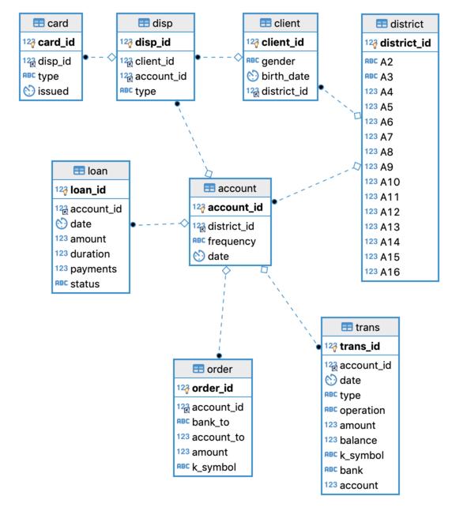

# Loan default prediction 

This example project walks you through the textbook data science problem of
loan default prediction. It demonstrates how to automate the most tedious parts
of the process - data wrangling. A production-ready solution is developed in
just a few hours - still beating most other models.

This example is well-suited if you want to learn how to

* approach a real-world dataset
* train a basic getML pipeline
* perform a hyperparameter optimization
* interpret features generated using getML

## Dataset

This tutorial features a use case from the financial sector. The analysis is
based on the [financial](https://relational.fit.cvut.cz/dataset/Financial)
dataset from the [the CTU Prague Relational Learning
Repository](https://arxiv.org/abs/1511.03086). It contains information on
606 successful and 76 unsuccessful loans and consists of 8 tables:




## Results

The loans data set is one of the most commonly used data sets in the relational
learning literature. Nonetheless, getML outperforms practically all
peer-reviewed academic papers based on the loans data set. 
The most important feature is found using Relboost. 
Transpiled to SQL it looks like this:

```sql
CREATE TABLE "FEATURE_2_4" AS
SELECT AVG( 
    CASE
        WHEN ( t2."balance" > 10430.000000 ) AND ( t2."bank" IN ( 'YZ', 'ST', 'QR', 'WX', 'CD', 'AB', 'UV', 'GH', 'IJ', 'KL', 'EF', 'MN', 'OP' ) ) AND ( datetime( t1."date" ) > datetime( t2."date", '+32.951613 days' ) ) THEN -19.024116
        WHEN ( t2."balance" > 10430.000000 ) AND ( t2."bank" IN ( 'YZ', 'ST', 'QR', 'WX', 'CD', 'AB', 'UV', 'GH', 'IJ', 'KL', 'EF', 'MN', 'OP' ) ) AND ( datetime( t1."date" ) <= datetime( t2."date", '+32.951613 days' ) OR t1."date" IS NULL OR t2."date" IS NULL ) THEN -32.262087
        WHEN ( t2."balance" > 10430.000000 ) AND ( t2."bank" NOT IN ( 'YZ', 'ST', 'QR', 'WX', 'CD', 'AB', 'UV', 'GH', 'IJ', 'KL', 'EF', 'MN', 'OP' ) ) AND ( t2."k_symbol" IN ( 'SIPO' ) ) THEN 32.559286
        WHEN ( t2."balance" > 10430.000000 ) AND ( t2."bank" NOT IN ( 'YZ', 'ST', 'QR', 'WX', 'CD', 'AB', 'UV', 'GH', 'IJ', 'KL', 'EF', 'MN', 'OP' ) ) AND ( t2."k_symbol" NOT IN ( 'SIPO' ) ) THEN -18.534438
        WHEN ( t2."balance" <= 10430.000000 OR t2."balance" IS NULL ) AND ( t2."balance" > 8451.000000 ) AND ( t2."bank" IN ( 'KL' ) ) THEN 394.075942
        WHEN ( t2."balance" <= 10430.000000 OR t2."balance" IS NULL ) AND ( t2."balance" > 8451.000000 ) AND ( t2."bank" NOT IN ( 'KL' ) ) THEN -32.813926
        WHEN ( t2."balance" <= 10430.000000 OR t2."balance" IS NULL ) AND ( t2."balance" <= 8451.000000 OR t2."balance" IS NULL ) AND ( datetime( t1."date" ) > datetime( t2."date", '+31.086957 days' ) ) THEN -0.130672
        WHEN ( t2."balance" <= 10430.000000 OR t2."balance" IS NULL ) AND ( t2."balance" <= 8451.000000 OR t2."balance" IS NULL ) AND ( datetime( t1."date" ) <= datetime( t2."date", '+31.086957 days' ) OR t1."date" IS NULL OR t2."date" IS NULL ) THEN 39.412646
        ELSE NULL
    END
) AS "feature_2_4",
     t1.rowid AS "rownum"
FROM "population" t1
LEFT JOIN "trans" t2
ON t1."account_id" = t2."account_id"
WHERE datetime( t2."date" ) <= datetime( t1."date" )
GROUP BY t1.rowid;
```
