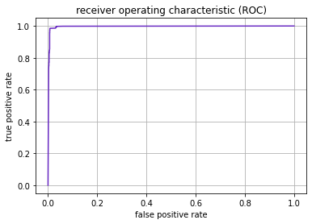

# Occupancy detection

The occupancy detection data set is a very simple multivariate time series.
This is to demonstrate how relational learning can be successfully applied to
time series.

The key is a self-join. Instead of creating features by merging and aggregating
peripheral tables in a relational data model,  we perform the
same operations on the population table itself. This results in features like
these:

* Aggregations over time, such as the average value of some column for the last 3 days.

* Seasonal effects, such as today is a Wednesday, so let's get the average value for the last four Wednesdays.

* Lag variables, such as get the value of some column from two hours ago.

Using getML's algorithms for relational learning, we can extract all of these
features automatically. Having created a flat table of such features, we can
then apply state-of-the-art machine learning algorithms, like xgboost.

## Data set

This project is based on a public domain time series dataset. It is available
in the UC Irvine Machine Learning Repository. The challenge is straightforward:
We want to predict whether an office room is occupied at a given moment in time
using sensor data. The data is measured about once a minute. The ground-truth
occupancy was obtained from time-stamped pictures. The available columns are
as follows:

* Date, year-month-day hour:minute:second
* Temperature, in Celsius
* Relative Humidity, %
* Light, in Lux
* CO2, in ppm
* Humidity Ratio, Derived quantity from temperature and relative humidity, in kgwater-vapor/kg-air
* Occupancy, 0 or 1, 0 for not occupied, 1 for occupied status

## Result

This project demonstrates that relational learning is a powerful tool for time
series. getML is able to outperform the benchmarks for a scientific paper on a
simple public domain time series data set using relatively little effort.

